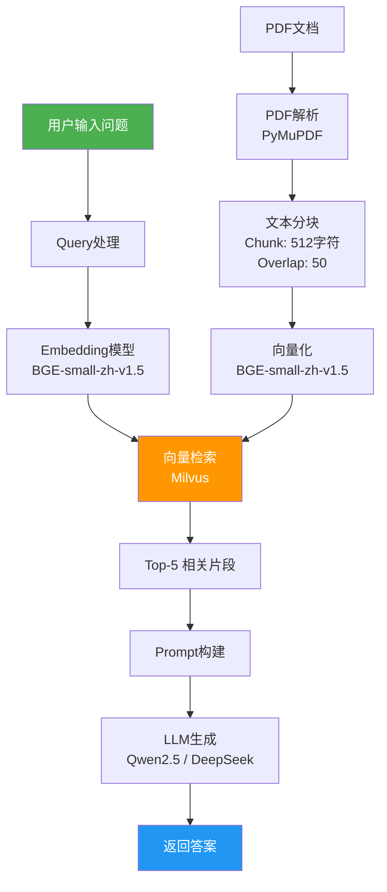

# 工单1 系统架构设计

## RAG PDF问答系统整体架构

## 模块说明

| 模块 | 文件 | 功能 |
|------|------|------|
| PDF解析 | pdf_parser.py | 提取PDF文本内容 |
| 向量存储 | vector_store.py | Milvus存取管理 |
| 问答引擎 | qa_engine.py | 检索+生成主逻辑 |
| Web界面 | app.py | Gradio交互界面 |
| 配置管理 | config.py | 参数统一配置 |
