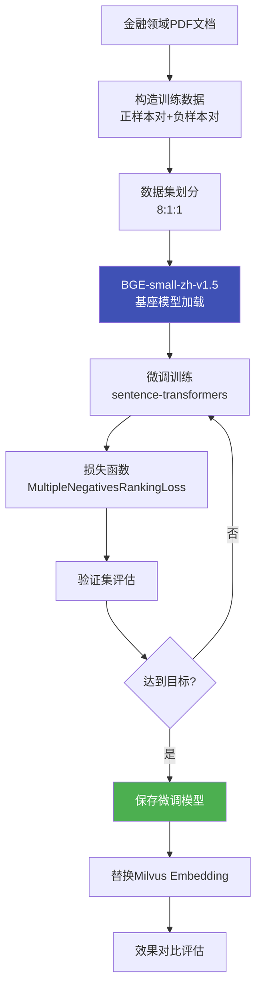
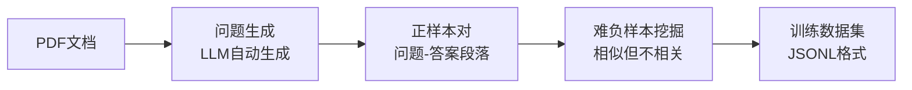

# 工单11 Embedding微调方案设计

## 微调流程架构

```mermaid
flowchart TD
    A[金融领域PDF文档] --> B[构造训练数据\n正样本对+负样本对]
    B --> C[数据集划分\n8:1:1]

    C --> D[BGE-small-zh-v1.5\n基座模型加载]
    D --> E[微调训练\nsentence-transformers]
    E --> F[损失函数\nMultipleNegativesRankingLoss]
    F --> G[验证集评估]
    G --> H{达到目标?}
    H -->|否| E
    H -->|是| I[保存微调模型]
    I --> J[替换Milvus Embedding]
    J --> K[效果对比评估]

    style D fill:#3F51B5,color:#fff
    style I fill:#4CAF50,color:#fff
```

## 训练数据构造

```mermaid
flowchart LR
    A[PDF文档] --> B[问题生成\nLLM自动生成]
    B --> C[正样本对\n问题-答案段落]
    C --> D[难负样本挖掘\n相似但不相关]
    D --> E[训练数据集\nJSONL格式]
```
