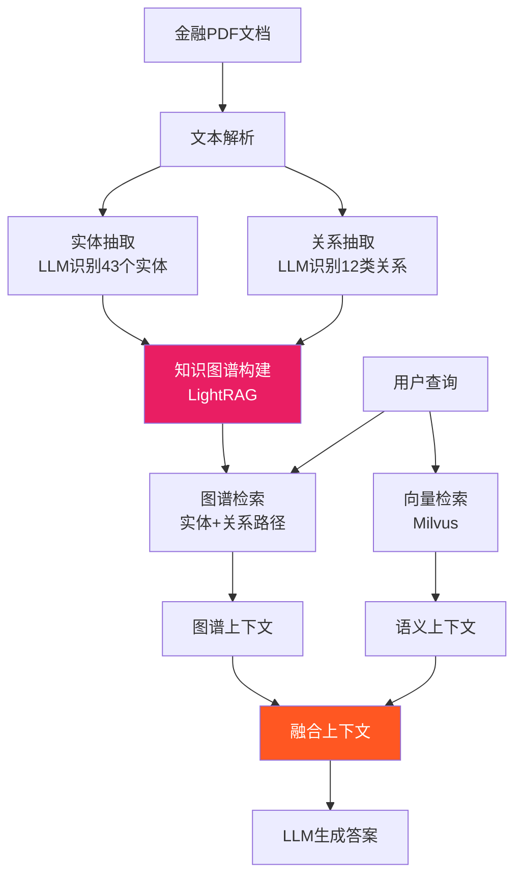
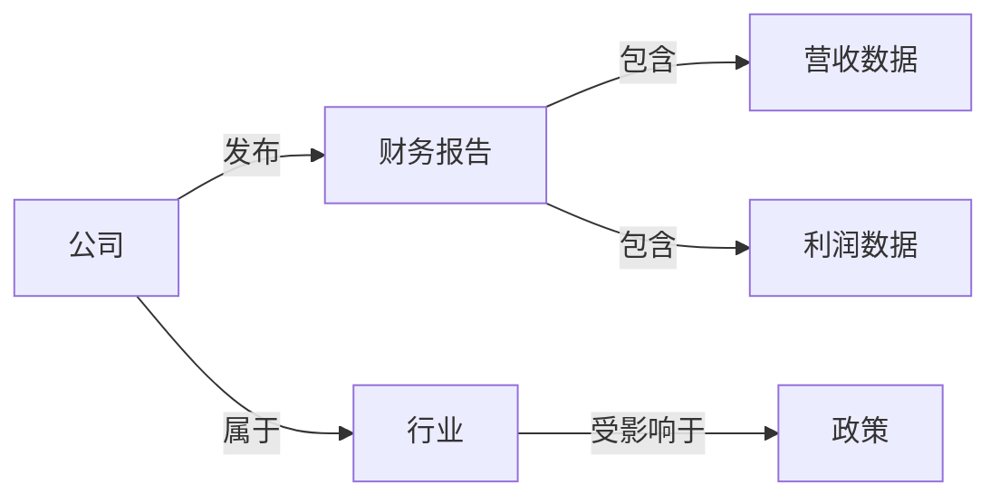

# 工单12 LightRAG架构设计

## 知识图谱增强RAG架构

```mermaid
flowchart TD
    A[金融PDF文档] --> B[文本解析]
    B --> C[实体抽取\nLLM识别43个实体]
    B --> D[关系抽取\nLLM识别12类关系]
    C --> E[知识图谱构建\nLightRAG]
    D --> E

    F[用户查询] --> G[图谱检索\n实体+关系路径]
    F --> H[向量检索\nMilvus]

    E --> G
    G --> I[图谱上下文]
    H --> J[语义上下文]

    I --> K[融合上下文]
    J --> K
    K --> L[LLM生成答案]

    style E fill:#E91E63,color:#fff
    style K fill:#FF5722,color:#fff
```

## 知识图谱结构

```mermaid
graph LR
    公司 -->|发布| 财务报告
    财务报告 -->|包含| 营收数据
    财务报告 -->|包含| 利润数据
    公司 -->|属于| 行业
    行业 -->|受影响于| 政策
```
