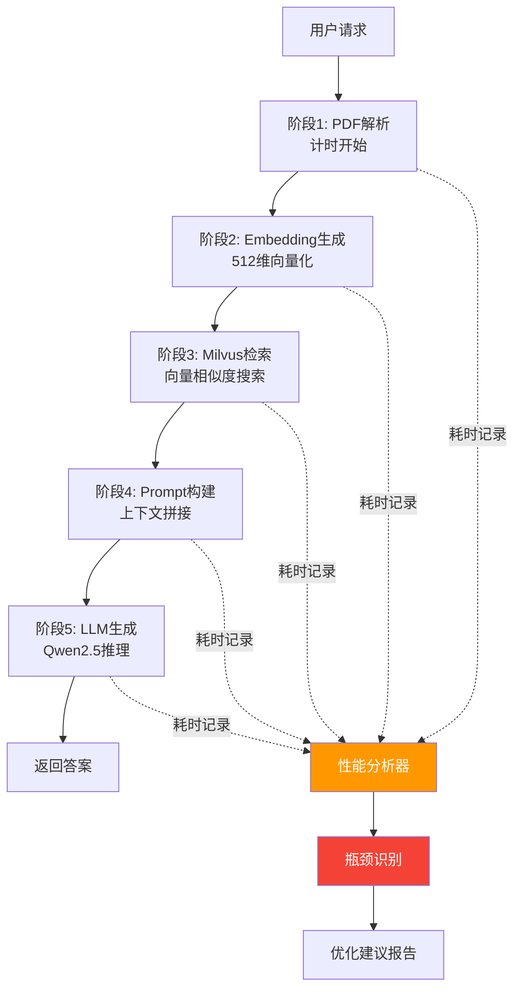
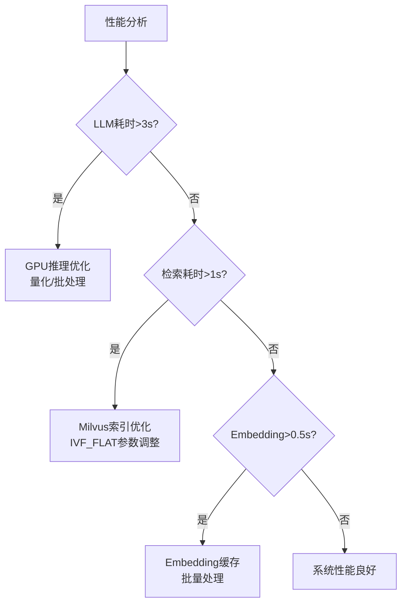

# 工单13 性能分析架构设计

## RAG全链路性能分析框架

```mermaid
flowchart TD
    A[用户请求] --> B[阶段1: PDF解析\n计时开始]
    B --> C[阶段2: Embedding生成\n512维向量化]
    C --> D[阶段3: Milvus检索\n向量相似度搜索]
    D --> E[阶段4: Prompt构建\n上下文拼接]
    E --> F[阶段5: LLM生成\nQwen2.5推理]
    F --> G[返回答案]

    B -.->|耗时记录| H[性能分析器]
    C -.->|耗时记录| H
    D -.->|耗时记录| H
    E -.->|耗时记录| H
    F -.->|耗时记录| H

    H --> I[瓶颈识别]
    I --> J[优化建议报告]

    style H fill:#FF9800,color:#fff
    style I fill:#F44336,color:#fff
```

## 性能优化决策树

```mermaid
flowchart TD
    A[性能分析] --> B{LLM耗时>3s?}
    B -->|是| C[GPU推理优化\n量化/批处理]
    B -->|否| D{检索耗时>1s?}
    D -->|是| E[Milvus索引优化\nIVF_FLAT参数调整]
    D -->|否| F{Embedding>0.5s?}
    F -->|是| G[Embedding缓存\n批量处理]
    F -->|否| H[系统性能良好]
```
