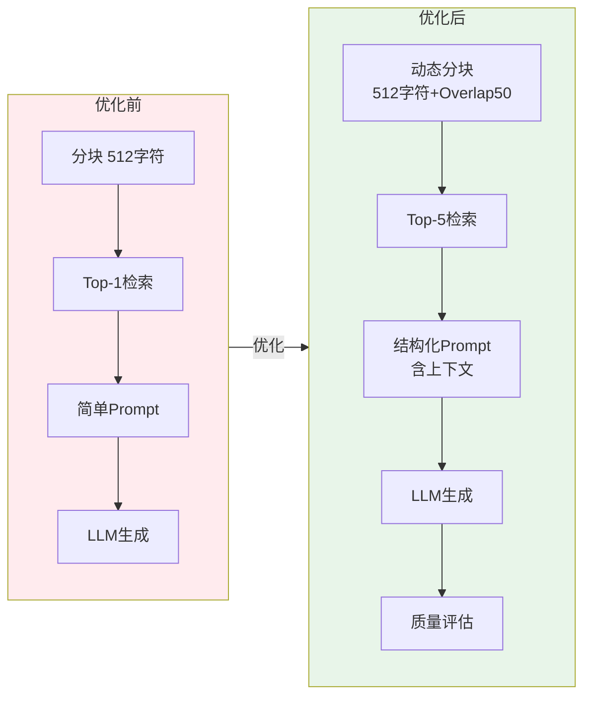
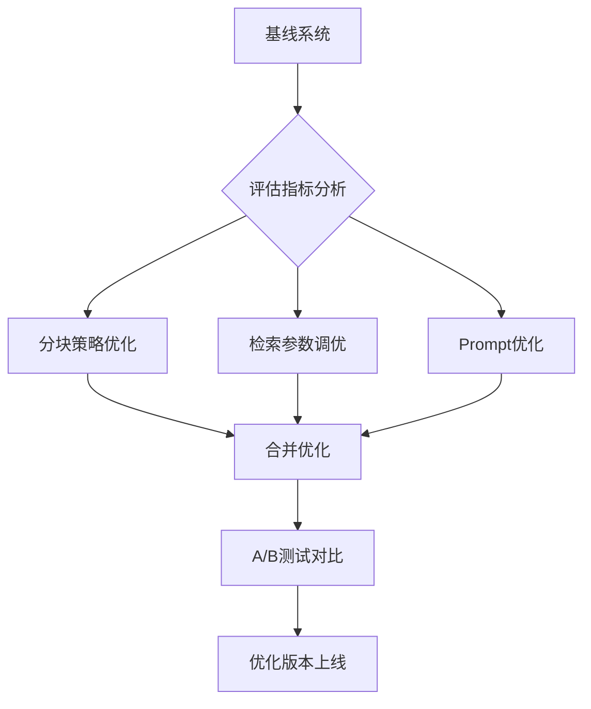

# 工单2 优化方案设计

## 优化前后对比架构

```mermaid
flowchart LR
    subgraph Before["优化前"]
        A1[分块 512字符] --> B1[Top-1检索]
        B1 --> C1[简单Prompt]
        C1 --> D1[LLM生成]
    end

    subgraph After["优化后"]
        A2[动态分块\n512字符+Overlap50] --> B2[Top-5检索]
        B2 --> C2[结构化Prompt\n含上下文]
        C2 --> D2[LLM生成]
        D2 --> E2[质量评估]
    end

    Before -->|优化| After

    style Before fill:#ffebee
    style After fill:#e8f5e9
```

## 优化流程

```mermaid
flowchart TD
    A[基线系统] --> B{评估指标分析}
    B --> C[分块策略优化]
    B --> D[检索参数调优]
    B --> E[Prompt优化]
    C --> F[合并优化]
    D --> F
    E --> F
    F --> G[A/B测试对比]
    G --> H[优化版本上线]
```
