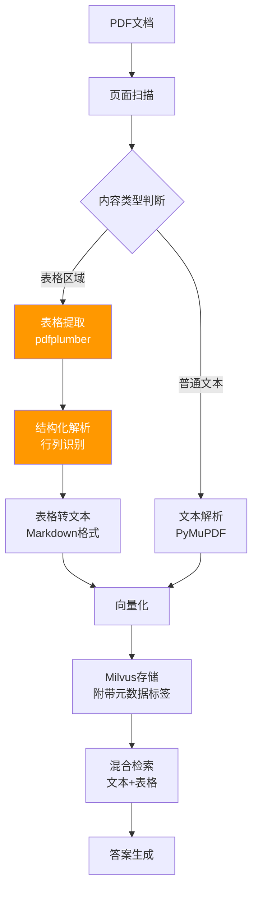
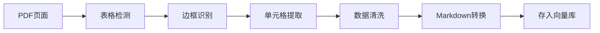

# 工单3 表格解析架构设计

## 表格解析及检索流程

```mermaid
flowchart TD
    A[PDF文档] --> B[页面扫描]
    B --> C{内容类型判断}
    C -->|普通文本| D[文本解析\nPyMuPDF]
    C -->|表格区域| E[表格提取\npdfplumber]

    E --> F[结构化解析\n行列识别]
    F --> G[表格转文本\nMarkdown格式]
    G --> H[向量化]
    D --> H

    H --> I[Milvus存储\n附带元数据标签]
    I --> J[混合检索\n文本+表格]
    J --> K[答案生成]

    style E fill:#FF9800,color:#fff
    style F fill:#FF9800,color:#fff
```

## 表格解析模块设计

```mermaid
flowchart LR
    A[PDF页面] --> B[表格检测]
    B --> C[边框识别]
    C --> D[单元格提取]
    D --> E[数据清洗]
    E --> F[Markdown转换]
    F --> G[存入向量库]
```
