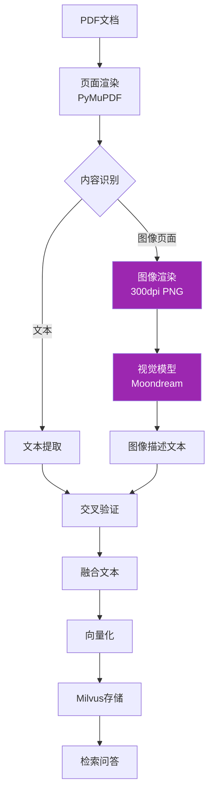
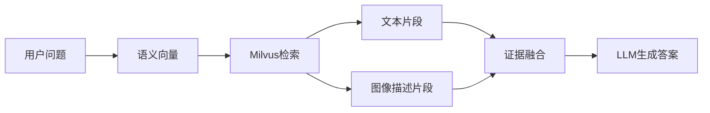

# 工单4 图像解析架构设计

## 图文联合解析流程

```mermaid
flowchart TD
    A[PDF文档] --> B[页面渲染\nPyMuPDF]
    B --> C{内容识别}
    C -->|文本| D[文本提取]
    C -->|图像页面| E[图像渲染\n300dpi PNG]

    E --> F[视觉模型\nMoondream]
    F --> G[图像描述文本]

    D --> H[交叉验证]
    G --> H
    H --> I[融合文本]
    I --> J[向量化]
    J --> K[Milvus存储]
    K --> L[检索问答]

    style E fill:#9C27B0,color:#fff
    style F fill:#9C27B0,color:#fff
```

## 多模态检索设计

```mermaid
flowchart LR
    A[用户问题] --> B[语义向量]
    B --> C[Milvus检索]
    C --> D[文本片段]
    C --> E[图像描述片段]
    D --> F[证据融合]
    E --> F
    F --> G[LLM生成答案]
```
