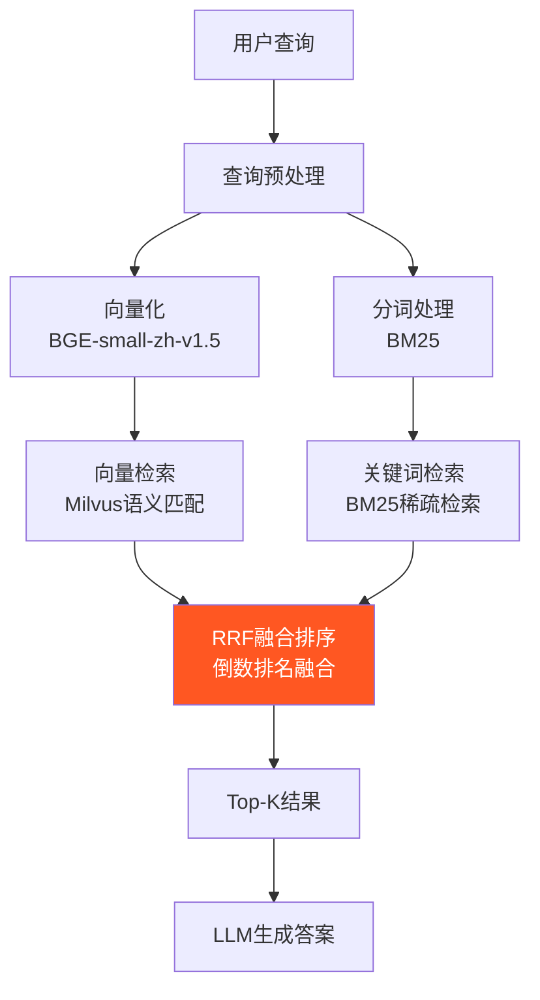
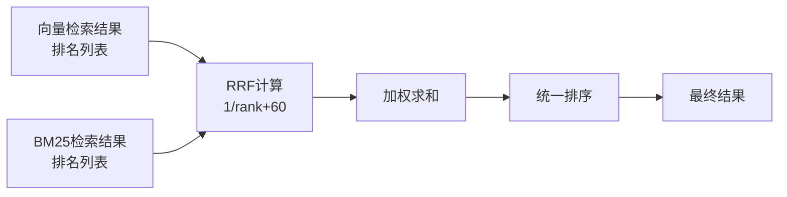

# 工单6 混合检索架构设计

## 混合检索系统架构

```mermaid
flowchart TD
    A[用户查询] --> B[查询预处理]
    B --> C[向量化\nBGE-small-zh-v1.5]
    B --> D[分词处理\nBM25]

    C --> E[向量检索\nMilvus语义匹配]
    D --> F[关键词检索\nBM25稀疏检索]

    E --> G[RRF融合排序\n倒数排名融合]
    F --> G

    G --> H[Top-K结果]
    H --> I[LLM生成答案]

    style G fill:#FF5722,color:#fff
```

## RRF融合算法

```mermaid
flowchart LR
    A[向量检索结果\n排名列表] --> C[RRF计算\n1/rank+60]
    B[BM25检索结果\n排名列表] --> C
    C --> D[加权求和]
    D --> E[统一排序]
    E --> F[最终结果]
```
