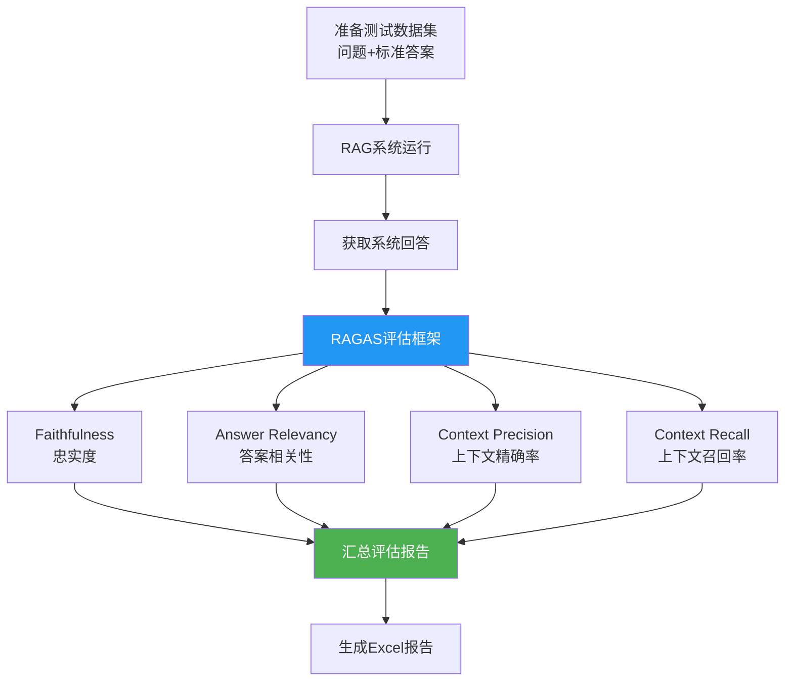
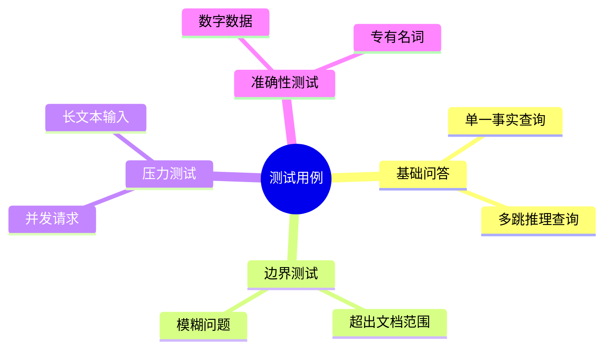

# 工单7 功能测试方案设计

## 测试评估流程

```mermaid
flowchart TD
    A[准备测试数据集\n问题+标准答案] --> B[RAG系统运行]
    B --> C[获取系统回答]
    C --> D[RAGAS评估框架]

    D --> E[Faithfulness\n忠实度]
    D --> F[Answer Relevancy\n答案相关性]
    D --> G[Context Precision\n上下文精确率]
    D --> H[Context Recall\n上下文召回率]

    E --> I[汇总评估报告]
    F --> I
    G --> I
    H --> I
    I --> J[生成Excel报告]

    style D fill:#2196F3,color:#fff
    style I fill:#4CAF50,color:#fff
```

## 测试用例设计

```mermaid
mindmap
  root((测试用例))
    基础问答
      单一事实查询
      多跳推理查询
    边界测试
      超出文档范围
      模糊问题
    压力测试
      并发请求
      长文本输入
    准确性测试
      数字数据
      专有名词
```
